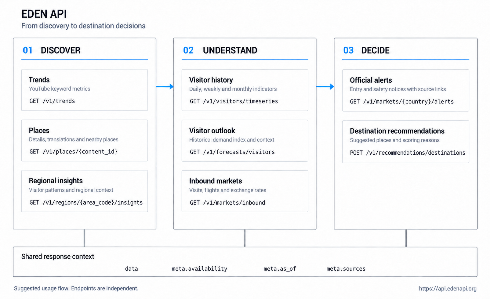

<h1 align="center">EDEN API</h1>

<p align="center">
  <strong>Korean tourism data, in one API.</strong>
</p>

<p align="center">
  한국 관광지와 지역 방문 지표를 조회하고,<br>
  방한시장을 비교해 여행 목적지를 추천합니다.
</p>

<p align="center">
  
  
  
  
</p>

<p align="center">
  <a href="https://api.edenapi.org/docs"><strong>API 문서</strong></a> |
  <a href="https://api.edenapi.org/openapi.json">OpenAPI</a> |
  <a href="#바로-사용하기">빠른 시작</a> |
  <a href="CHANGELOG.md">변경 기록</a>
</p>

<p align="center">
  
</p>

---

## 어떤 정보를 제공하나요?

EDEN은 서로 다른 관광 데이터의 지역 코드와 관광지 ID를 연결해 일관된 JSON으로 제공합니다. 관광지 상세를 열고, 지역 방문 흐름을 살펴보고, 국가별 방한시장을 비교하는 기능을 앱에 붙일 수 있습니다.

| 기능 | 제공 정보 |
| --- | --- |
| 여행 트렌드 | 수집한 여행 키워드의 YouTube 영상 수와 조회 수 |
| 지역 인사이트 | 지역별 방문 지표와 이전 기간 비교 |
| 관광지 상세 | 이름과 위치, 보유 번역, 주변 상점 및 연관 관광지 |
| 방문 전망 | 과거 관측을 바탕으로 계산한 참고 수요 지수와 가용한 날씨 정보 |
| 방문 시계열 | 일별, 주별 또는 월별 방문 지표 |
| 방한시장 비교 | 일본, 중국, 대만, 미국, 필리핀의 방한 지표와 항공 및 환율 |
| 공식 공지 | 시장별 입국 및 안전 공지와 원문 링크 |
| 목적지 추천 | 지역과 테마에 맞는 관광지와 추천 근거 |

> **현재 운영 상태:** 공개 API는 기존 게시 데이터를 조회합니다. 자동 수집과 갱신은 중지돼 있습니다. 응답의 관측일과 최신성 정보를 확인하세요.

## 바로 사용하기

공개 API는 인증 키 없이 호출할 수 있습니다.

```text
https://api.edenapi.org/v1
```

서울의 지역 인사이트를 조회합니다.

```bash
curl -fsS 'https://api.edenapi.org/v1/regions/1100000000/insights?period=30d'
```

일본 시장을 대상으로 문화 관광지 5곳을 추천받습니다.

```bash
curl -fsS 'https://api.edenapi.org/v1/recommendations/destinations' \
  -H 'Content-Type: application/json' \
  -d '{
    "target_country": "JP",
    "travel_window": {"season": "autumn"},
    "themes": ["culture"],
    "limit": 5
  }'
```

브라우저에서도 바로 사용할 수 있습니다.

```javascript
const response = await fetch(
  'https://api.edenapi.org/v1/markets/inbound?countries=JP&countries=US'
);
if (!response.ok) throw new Error(`EDEN API: ${response.status}`);

const { data, meta } = await response.json();
console.log(data, meta.availability, meta.as_of);
```

쿠키 없는 cross-origin GET과 POST를 허용합니다. `credentials: 'include'`는 사용하지 않습니다. 파라미터와 응답 예시는 [Swagger UI](https://api.edenapi.org/docs)에서 확인할 수 있습니다.

## API 목록

| 메서드 | 경로 | 용도 |
| --- | --- | --- |
| `GET` | `/v1/trends` | 여행 키워드 트렌드 |
| `GET` | `/v1/regions/{area_code}/insights` | 지역 인사이트 |
| `GET` | `/v1/places/{content_id}` | 관광지 상세 |
| `GET` | `/v1/forecasts/visitors` | 방문 전망 |
| `GET` | `/v1/visitors/timeseries` | 방문 시계열 |
| `GET` | `/v1/markets/inbound` | 방한시장 비교 |
| `GET` | `/v1/markets/{country}/alerts` | 공식 공지 |
| `POST` | `/v1/recommendations/destinations` | 목적지 추천 |

추천 응답의 `place.content_id`로 관광지 상세를 조회할 수 있습니다. 국가 코드는 `JP`, `CN`, `TW`, `US`, `PH`를 지원합니다. 방문 전망은 기본 7일이며 최대 30일까지 요청할 수 있습니다.

## 응답 읽기

정상 조회 응답은 `data`와 `meta`로 구성됩니다. 데이터가 없는 경우에도 임의의 0이나 추정 사실을 채우지 않습니다.

| 필드 | 의미 |
| --- | --- |
| `data` | 조회 결과. 자료가 없으면 `null`이거나 빈 결과일 수 있음 |
| `meta.availability` | 전체 결과의 가용성 |
| `meta.reason` | 제공 범위가 제한되거나 결과가 없는 이유 |
| `meta.as_of` | 데이터 기준 시점 |
| `meta.freshness` | 최신성 상태와 허용 지연 기준 |
| `meta.sources` | 원천별 관측 시점과 수집 상태 |

원천의 발표 주기가 다르므로 보조 정보가 오래됐는지도 개별 필드에서 확인해야 합니다. 잘못된 입력은 `422`, 존재하지 않는 ID는 `404`, 호출 제한 초과는 `429`를 반환합니다.

### 숫자의 의미

- **YouTube 지표**는 검색 결과 영상 표본의 공개 수치입니다. 검색 국가 조건이 실제 시청자 국적을 뜻하지 않습니다.
- **방문 전망**의 `historical_weekday_proxy`는 과거 같은 요일의 관측을 활용한 참고 지수입니다. 실제 예상 인원과 구분합니다.
- **추천 조건** 중 계산에 반영하지 못한 항목은 `unapplied_inputs`에 이유와 함께 표시합니다. 계절도 근거가 있는 혼잡도 계산에만 반영합니다.
- **공지 번역과 요약**은 준비된 경우에 제공합니다. 번역이 없어도 보유한 원문은 확인할 수 있습니다.

원천별 이용 권한과 수집 범위에 따라 데이터 가용성이 달라집니다. NAVER 영구 저장은 비활성화돼 있으며, 승인되지 않은 SNS의 지표를 만들어 제공하지 않습니다.

## 동작 구조

```text
외부 원천 → 수집 및 정규화 → MariaDB 게시 데이터 → FastAPI → 클라이언트
```

공개 요청은 게시된 DB 데이터만 읽습니다. 요청 중 외부 데이터 수집이나 LLM 호출이 발생하지 않으며, 추천 POST도 조회 작업입니다.

수집 코드에는 요청량과 보관 범위 제한이 있습니다. 운영에서는 `SCHEDULER_ENABLED=false`로 수집기와 자동 정리를 중지했습니다. API 요청 통계도 DB에 저장하지 않으며 재배포가 관찰 타이머를 다시 켜지 않습니다.

| 구성 | 역할 |
| --- | --- |
| FastAPI + Pydantic | 입력 검증과 응답 계약 및 OpenAPI 문서 |
| MariaDB + SQLAlchemy | 원천 데이터와 정규화 데이터 및 게시본 저장 |
| Alembic | DB 마이그레이션 |
| Nginx + systemd | HTTPS 진입점과 요청 제한 및 프로세스 관리 |

## 개발

Python 3.12와 `uv`를 사용합니다. MariaDB Connector/C 3.4 이상이 필요하며, DB 연결은 인증서 검증 TLS를 사용합니다.

```bash
uv sync --frozen
```

개발용 `.env`와 기기별 `.ops/` 런처는 관리자로부터 별도로 받아야 합니다. 비밀값과 서버 접속 설정은 저장소에 포함하지 않습니다.

```bash
./.ops/run.sh check
./.ops/run.sh db-check
./.ops/run.sh
```

개발 런처는 기존 원격 MariaDB에 SSH 터널로 연결합니다. 별도 로컬 DB를 만들지 않으며, API는 `127.0.0.1:8000`에서 스케줄러 없이 실행됩니다. 로컬 문서는 `http://127.0.0.1:8000/docs`에서 확인합니다.

검증:

```bash
uv lock --check
uv run ruff check app scripts migrations tests
uv run pytest -q
```

### 저장소 구성

```text
app/
  api/             # 엔드포인트, 스키마, 문서
  sources/         # 외부 데이터 원천
  ingestion/       # 수집과 보관 정책
  normalization/   # 지역과 관광지 식별 및 정규화
  products/        # 집계와 전망 및 추천 게시본
  readmodels/      # 공개 API 조회
  scheduler/       # 수집 실행 코드, 운영에서는 비활성화
migrations/        # Alembic 마이그레이션
scripts/           # 공통 운영 도구
tests/            # 계약, 통합, 단위 및 운영 검증
```

<details>
<summary><strong>관리자 실행과 배포</strong></summary>

`.env`는 유일하게 수동 관리하는 설정 원본이며 권한은 `600`입니다. 셸에서 `source`하지 않습니다. API 읽기 계정과 수집 쓰기 계정 및 마이그레이션 계정은 분리합니다.

```bash
# 읽기 전용 DB 마이그레이션 상태 확인
./.ops/run.sh migrate current

# 설정과 연결 확인
./.ops/deploy.sh env-check
./.ops/deploy.sh preflight

# 운영 배포
./.ops/deploy.sh deploy
```

배포는 루트 `.env`에서 운영 설정을 생성합니다. SSH 호스트 fingerprint와 DB TLS 및 계정 분리를 검사하고, readiness 실패 시 이전 release와 설정을 복구합니다. `preflight`는 운영 배포를 수행하지 않습니다.

스키마 변경은 별도 요청이 있을 때만 진행합니다. DB 백업과 복원 명령은 비활성화돼 있습니다. 공개 API 문서는 `/docs`, 내부 상태 확인은 loopback의 `/internal/readiness`에서 제공합니다.

</details>
