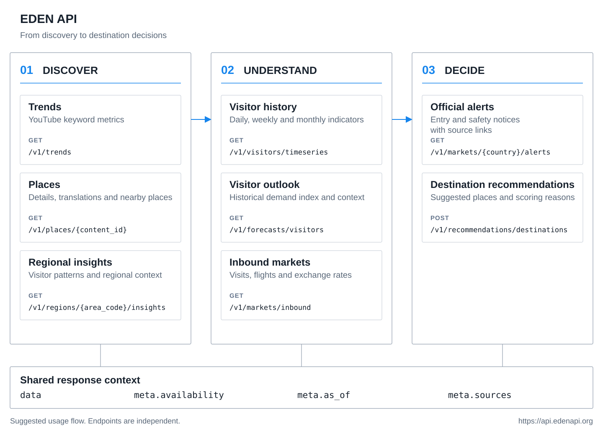

<h1 align="center">EDEN API</h1>

<p align="center">
  <strong>Korean tourism data, in one API.</strong>
</p>

<p align="center">
  Explore Korean destinations and regional visitor patterns.<br>
  Compare inbound markets and find places to recommend.
</p>

<p align="center">
  
  
  
  
</p>

<p align="center">
  <a href="https://api.edenapi.org/docs"><strong>API Docs</strong></a> |
  <a href="https://api.edenapi.org/openapi.json">OpenAPI</a> |
  <a href="#quick-start">Quick Start</a> |
  <a href="CHANGELOG.md">Changelog</a>
</p>

<p align="center">
  <a href="assets/eden-api-overview.svg">
    
  </a>
</p>

---

## What It Does

EDEN connects regional codes and place identifiers across tourism data sources and exposes the results as consistent JSON. Use it to add place details, regional visitor analysis, and inbound market comparisons to your application.

| Feature | Available information |
| --- | --- |
| Travel trends | Video counts and views for collected YouTube travel keywords |
| Regional insights | Regional visitor indicators and comparisons with earlier periods |
| Place details | Names, locations, available translations, nearby shops, and related places |
| Visitor outlook | Reference demand indices based on past observations, with available weather context |
| Visitor history | Daily, weekly, or monthly visitor indicators |
| Inbound markets | Visitor, flight, and exchange-rate indicators for Japan, China, Taiwan, the US, and the Philippines |
| Official alerts | Entry and safety notices with links to their sources |
| Destination recommendations | Places matching a region and theme, with scoring reasons |

> **Current deployment:** The public API serves previously published data. Automatic collection and refresh are disabled. Check observation dates and freshness metadata before using the results.

## Quick Start

The public API does not require an API key.

```text
https://api.edenapi.org/v1
```

Get regional insights for Seoul:

```bash
curl -fsS 'https://api.edenapi.org/v1/regions/1100000000/insights?period=30d'
```

Request five cultural destinations for the Japanese market:

```bash
curl -fsS 'https://api.edenapi.org/v1/recommendations/destinations' \
  -H 'Content-Type: application/json' \
  -d '{
    "target_country": "JP",
    "travel_window": {"season": "autumn"},
    "themes": ["culture"],
    "limit": 5
  }'
```

Call the API from a browser:

```javascript
const response = await fetch(
  'https://api.edenapi.org/v1/markets/inbound?countries=JP&countries=US'
);
if (!response.ok) throw new Error(`EDEN API: ${response.status}`);

const { data, meta } = await response.json();
console.log(data, meta.availability, meta.as_of);
```

Cross-origin GET and POST requests are supported without cookies. Do not set `credentials: 'include'`. See [Swagger UI](https://api.edenapi.org/docs) for parameters and response examples.

## Endpoints

| Method | Path | Purpose |
| --- | --- | --- |
| `GET` | `/v1/trends` | Travel keyword trends |
| `GET` | `/v1/regions/{area_code}/insights` | Regional insights |
| `GET` | `/v1/places/{content_id}` | Place details |
| `GET` | `/v1/forecasts/visitors` | Visitor outlook |
| `GET` | `/v1/visitors/timeseries` | Visitor history |
| `GET` | `/v1/markets/inbound` | Inbound market comparisons |
| `GET` | `/v1/markets/{country}/alerts` | Official notices |
| `POST` | `/v1/recommendations/destinations` | Destination recommendations |

Use `place.content_id` from a recommendation to fetch its place details. Supported country codes are `JP`, `CN`, `TW`, `US`, and `PH`. Visitor outlook requests default to 7 days and support up to 30 days.

## Reading Responses

Successful queries return a `data` and `meta` envelope. Missing information is not replaced with invented values or zeros.

| Field | Meaning |
| --- | --- |
| `data` | Query result; may be `null` or empty when data is unavailable |
| `meta.availability` | Availability of the overall result |
| `meta.reason` | Why a result is limited or unavailable |
| `meta.as_of` | Data reference timestamp |
| `meta.freshness` | Freshness status and acceptable age |
| `meta.sources` | Observation timestamps and collection status for each source |

Sources publish on different schedules. Check individual data blocks as well as the overall metadata. Invalid inputs return `422`, unknown IDs return `404`, and requests exceeding rate limits return `429`.

### Understanding the Indicators

- **YouTube metrics** describe a sample of publicly available search results. A search region filter does not identify viewers' nationalities.
- **Visitor outlook** may use `historical_weekday_proxy`, a reference index based on observations from the same weekday. This is distinct from an actual visitor count forecast.
- **Recommendation inputs** that cannot be applied appear in `unapplied_inputs`, with reasons. Season only affects crowd calculations when supporting observations exist.
- **Notice translations and summaries** are returned when available. Original notices remain accessible when a translation is missing.

Availability depends on source permissions and collection coverage. Persistent storage of NAVER results is disabled. The API does not fabricate metrics for unsupported social platforms.

## How It Works

```text
External sources -> Collection and normalization -> Published MariaDB data -> FastAPI -> Client
```

Public requests only read published database snapshots. They do not trigger external collection or LLM calls. The recommendation POST is also a read operation.

Collection code includes request budgets and retention limits. The current deployment uses `SCHEDULER_ENABLED=false`, which disables collection and automatic cleanup. API usage statistics are not written to the database, and deployments do not reactivate observation timers while this setting is false.

| Component | Responsibility |
| --- | --- |
| FastAPI + Pydantic | Input validation, response contracts, and OpenAPI documentation |
| MariaDB + SQLAlchemy | Raw records, normalized data, and published snapshots |
| Alembic | Database migrations |
| Nginx + systemd | HTTPS entry point, rate limits, and process management |

## Development

Use Python 3.12 and `uv`. MariaDB Connector/C 3.4 or newer is required. Database connections use TLS with server certificate verification.

```bash
uv sync --frozen
```

Obtain the development `.env` and machine-specific `.ops/` launchers from a project maintainer. Credentials and server connection settings are not included in the repository.

```bash
./.ops/run.sh check
./.ops/run.sh db-check
./.ops/run.sh
```

The development launcher connects to the existing remote MariaDB through an SSH tunnel. It does not create a local database. The API runs at `127.0.0.1:8000` with the scheduler disabled. Local documentation is available at `http://127.0.0.1:8000/docs`.

Run the checks:

```bash
uv lock --check
uv run ruff check app scripts migrations tests
uv run pytest -q
```

### Repository Layout

```text
app/
  api/             # Endpoints, schemas, and documentation
  sources/         # External data adapters
  ingestion/       # Collection and retention policies
  normalization/   # Regional and place identity resolution
  products/        # Published aggregates, outlooks, and recommendations
  readmodels/      # Public API queries
  scheduler/       # Collection jobs; disabled in the current deployment
migrations/        # Alembic migrations
scripts/           # Shared operational tools
tests/             # Contract, integration, unit, and operations checks
```

<details>
<summary><strong>Maintainer Operations and Deployment</strong></summary>

The root `.env` is the only manually maintained configuration source and must have mode `600`. Do not load it with shell `source`. API reads, ingestion writes, and migrations use separate database accounts.

```bash
# Inspect migration status without changing the schema
./.ops/run.sh migrate current

# Check configuration and connectivity
./.ops/deploy.sh env-check
./.ops/deploy.sh preflight

# Deploy to production
./.ops/deploy.sh deploy
```

Deployment generates production configuration from the root `.env`. It verifies the SSH host fingerprint, database TLS, and account separation. Failed readiness checks restore the previous release and configuration. `preflight` does not deploy to production.

Schema changes require a separate request. Database backup and restore commands are disabled. Public API documentation is served at `/docs`; internal readiness is available on loopback at `/internal/readiness`.

</details>
